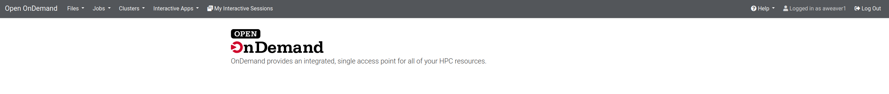
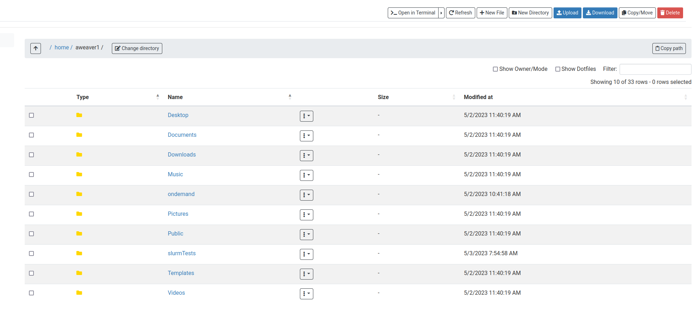
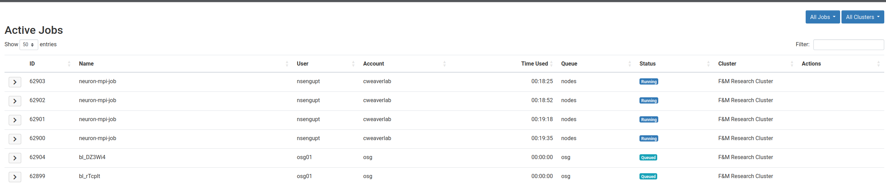
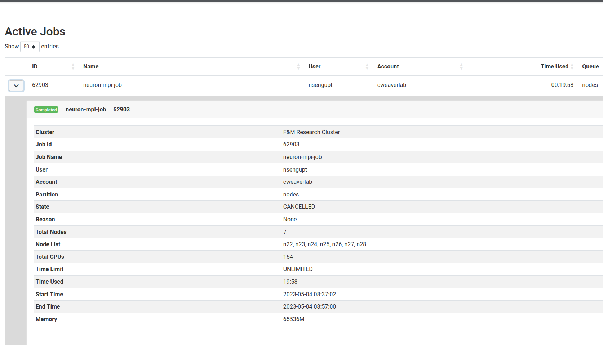
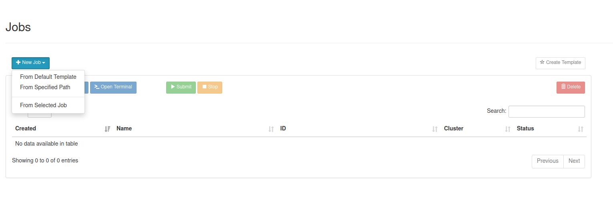

# Introduction to Open OnDemand (OOD)

Open OnDemand is a web portal that provides access to the F&M research cluster.
It allows user access and job management without the need for knowledge of Linux.
That said, you may still need to access the cluster directly for some purposes.

The URL is ```rcs-scsn.fandm.edu``` and your login credentials are your netID and password.
Please note that if you try to access this website from off campus, you must connected to the VPN first.

When you login you will get a page similar to:




This is meant as a very high level overview of using Open OnDemand.  More details can
often be found by searching on the web.  You can also reach out to us if you have questions.

## Features

- File management/transfer
- Job monitoring
- Job submission
- Linux shell access

## File Management/Transfer

You can access your home directory by selecting **Files --> Home Directory**.  You will be able to see
the files and directories in your home directory as well as upload/download/delete/move/copy files.



**Important** File uploads are limited to small files (25MB or less).  
Larger file uploads should still be done using ```scp``` ([see scp documentation](../access/03_scp.md))

## Job Monitoring

You can monitor running and queued jobs on the cluster by selecting **Jobs --> Active Jobs**.  You will
see a screen similar to the one below.  You may  also see some completed jobs if they were just recently
completely.  Completed jobs are not active so will eventually be removed from this screen.  On the right-hand-side
of the screen you can switch between viewing only your jobs and viewing all jobs.



You can see more information for a job by clicking the arrow to the left of each job.  This provides information
such as the node(s) the job is running on, how long it's been running, etc.



## Job Submissions

You can create and submit jobs by selecting **Jobs --> Job Composer**.  

### Creating jobs

You can create new jobs in 3 different ways

- Create a new job from scratch: **+New Job --> From Deafult Template**
- Create a new job based on a job you have on the cluster but is not listed in your list of jobs: **+New Job --> From specified Path**
  This option essentially converts a job you may already have on the cluster for use through OOD (more on this below)
- Create a new job based on another job currently in your list of jobs: **+New Job --> From Selected Job**



As mentioned if you already have a job or jobs on the cluster and you wish to submit them through OOD, you must create a new job using option 2.  Because of the internals
of OOD, you cannot use it directly.  Once you create your job in this way, you will have to make some edits to the job script.  As an example, consider a job in 
the directory ```/home/auser/job1``` using the following job script:

```bash
#!/bin/bash

#SBATCH --job-name=BSc-044aa
#SBATCH --output=BSc044aa_%j.out
#SBATCH --nodes=1
#SBATCH --ntasks-per-node=24
#SBATCH --mem-per-cpu=1G

# The next two lines are always required in order to run AMS and should not be modified
module purge
module load ams2022

date

bash BSc-044aa.run

date
```

In order to submit this through OOD you would need to modify the job script as follows to make sure you are in the ```/home/auser/job1``` 
before you run anything (the new line is after the last #SBATCH directive).

```bash
#!/bin/bash

#SBATCH --job-name=BSc-044aa
#SBATCH --output=BSc044aa_%j.out
#SBATCH --nodes=1
#SBATCH --ntasks-per-node=24
#SBATCH --mem-per-cpu=1G

# ***NEW: Make sure we are in the right directory where all our files might be
cd /home/auser/job1 

# The next two lines are always required in order to run AMS and should not be modified
module purge
module load ams2022

date

bash BSc-044aa.run

date
```
### Submitting and stopping jobs

You can submit a job by selecting it from your list and clicking the Submit button.  Similarly you can stop a running job by
selecting it from the job list and clicking the Stop button

## Linux Shell Access

You can access a Linux Shell by selecting **Clusters --> >_F&M Research Cluster Shell Access**.
This will open a new window to a Linux shell to your home directory.  From there you can
do almost anything you might normally do if your were connected to the cluster via SSH.