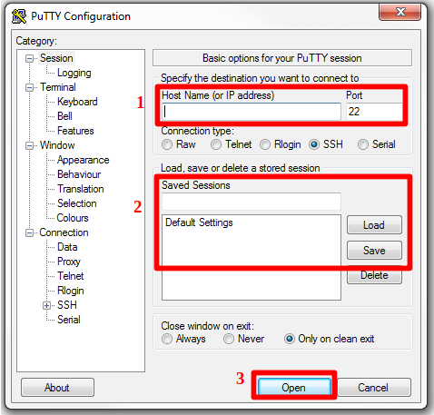
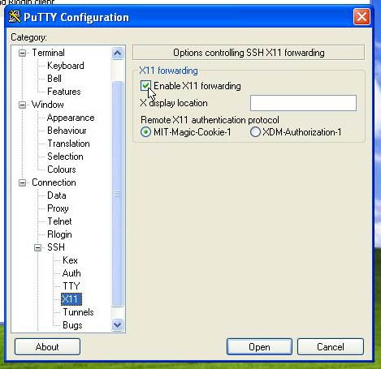

# Accessing Research Computing resources
UNDER CONSTRUCTION

## Preliminaries

In order to acceess Resource Computing resources from off-campus (i.e., not directly connected to F&M's network) you will have to connect to F&M's VPN, GlobalProtect, and DUO (soon switching to RapidIdentity) for authentication. Instructions for installing these programs are provided below:

- [Instructions for DUO](https://docs.google.com/document/d/1xZ3xIFEj_16zujJMGEPaSxO1-fAb2kbC25WxY7kP1jE/edit?usp=sharing)
- [Instructions for Global Protect VPN](https://docs.google.com/document/d/19nF8gaVCl8_c18pC95X19LQVZnGr3eLAkGlDcnsVV3c/edit?usp=sharing)
- [Instructions for Rapid Identity (coming soon)](coming soon)

If you are having trouble with these programs please contact the F&M helpdesk by calling them at 717-358-6789 or submitting a helpdesk ticket through heldesk.fandm.edu

In addition, there is operating system-specific setup(detailed below) that you will need in order to access our compute resources regardless of whether that access is on or off campus.

At the end of this documentation we have provided some basic troubleshooting tips when experiencing issues connecting.

### Mac OS X setup

By default, Mac OS X comes with a program called `terminal` which can be used for connecting to our systems.  The terminal program can be found in  Utilities folder which can be quickly opened using the keyboard shortcut `Shift+Command+U`.  Once you click on the terminal program to open it, we suggest you save it to your toolbar for faster access in the future.

If you will need to use an application that displays graphical windows (e.g., Matlab) then you must install [XQuartz](https://www.xquartz.org/).

Once terminal is running you connect using the `ssh` command as in `ssh userName@system.fandm.edu`.  For example:

`ssh aweaver29@rcs-scsn.fandm.edu`  

**Please note:** 
1. You may see a message about the authenticity of the host.  Type `yes` (the entire word) to continue connecting.
2. You will be prompted to enter your password.  **As you type, nothing will display on the screen**.  There is no problem and the system does know which characters are being typed.

In order to access graphical applications you must install [XQuartz](https://www.xquartz.org/).  Once installed, you need to start XQuartz (Go to Applications > Utilities > XQuartz) before doing the ssh command.  This will open a window which just has to be running.  Then when you ssh, the command changes slightly to use the `-Y` flag as `ssh -Y aweaver29@rcs-sc.fandm.edu`.

### Windows setup

For Windows machines we recommend installing PuTTY which can be found in the Microsoft Store (It's provided and updated by Simon Tatham).
If you will need to use an application that displays graphical windows (e.g., Matlab) we recommend you install [VcXsrv](https://sourceforge.net/projects/vcxsrv/) (Click the green Download button). 

To setup a new (non-graphical) connection

1. Put `userName@system.fandm.edu` in the box labelled `Host Name (or IP address)` (label 1 in the picture below).  For example: `aweaver29@rcs-scsn.fandm.edu`
2. Save the connection for easier access later by entering a name (whatever you want to call it) for it in the box `Saved Sessions` (label 2)  and click `Save`

For sessions that run graphical applications, some adjustments must be made to the configuration:
  
1. Select the session that needs to use graphical applications and click `Load` **but not** `Open`
2. In the box on the left-hand-side of the window labelled `Category:` click the following (in order)
    a. `Connection`
    b. `SSH`
    c. `X11`
3. Check the box labelled `Enable X11 forwarding`.  At this point, your PuTTY window should look similar to the one below.
4. Go back to the `Category:` box and click `Session`.  Then click `Save` to save the new settings.

**Please note:** 
1. You may see a message about the servers host key not being cached.  Click `yes` to continue connecting.
2. You will be prompted to enter your password.  **As you type, nothing will display on the screen**.  There is no problem and the system does know which characters are being typed.

To connect to a saved session, select it from the list and click `Load` and then `Open`

Once installed you need to make some adjustments to your PuTTY configuration

5. **Before** connecting to the server through PuTTY, start the VcXsrv application and then connect to the server as you normally would.

## Connecting

## Copying files to/from

## Troubleshooting Connection Problems

From time to time you may encounter issues connecting.  Often times the cause is one of the following:

1. Not connecting to VPN when off-campus
2. Username is mistyped
3. Server name is mistyped
4. Password mistyped.  This one is trickier to determine but check things like Caps Lock, Num Lock, etc.

If you have continued issues connecting then contact us at: dorc@fandm.edu