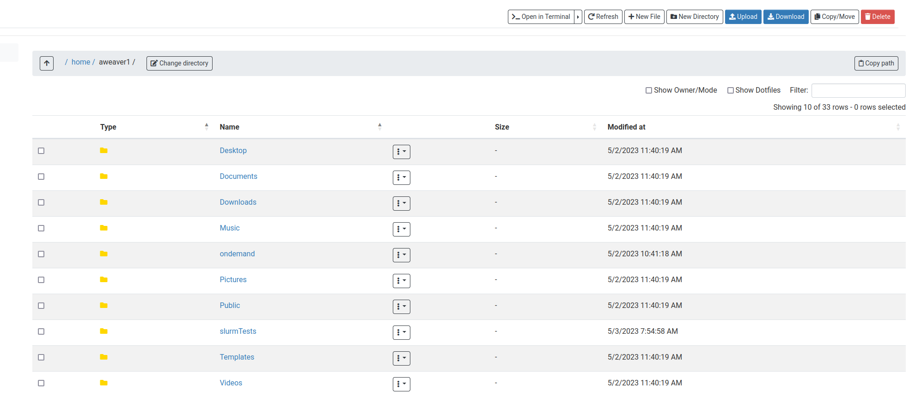
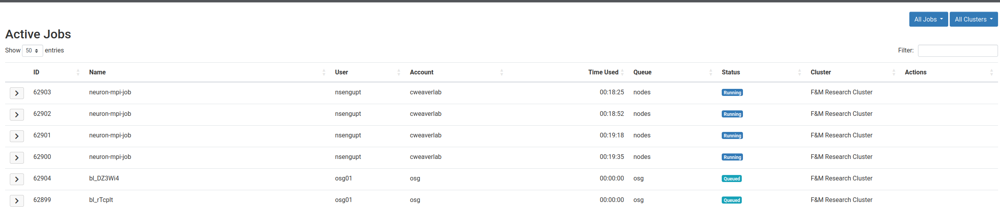
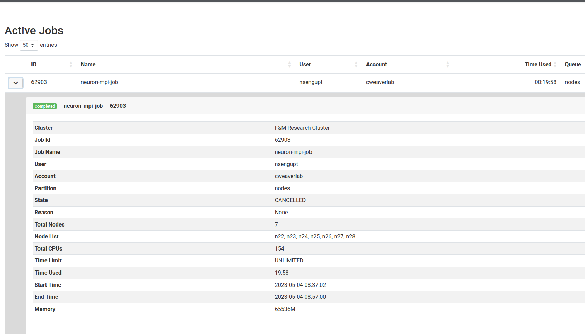
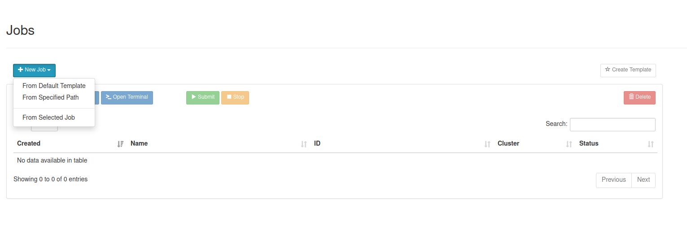

# Introduction: Web acces to cluster

Open OnDemand (OOD) is a web portal that provides browser-based access to the F&M research cluster. 
It allows user access and job management without the need to know much about Linux. 
However, we still recommending learning some Linux basics as there may be times 
you will still need to access the cluster directly through SSH.

OOD allows you to interact with the cluster instead of using SSH/SCP, providing functionality for

- File management/transfer
- Job submission/monitoring
- Linux shell access
- Running a small set of software packages via a GUI

The OOD URL for F&M's cluster is:

[https://rcs-scsn.fandm.edu](https://rcs-scsn.fandm.edu)


Your login credentials are your netID and password.

```note
Reminder that if you are off campus, you will not be able to access this URL unless you are connected to the VPN first
```

When you login you should see a page similar to the one below:


The remainder of this introduction provides a very high level overview of how to use Open OnDemand.  More details can 
be found by searching on the web or reaching out to us if you have questions.

## File Management/Transfer

You can access your home directory by selecting **Files --> Home Directory**.  You will be able to see 
the files and directories in your home directory as well as upload/download/delete/move/copy files.



```important
File uploads are limited to small files (25MB or less).  
Larger file uploads should still be done using `scp` ([see scp documentation](../access/scp.md))
```

## Job Submission and Monitoring

You can monitor running and queued jobs on the cluster by selecting **Jobs --> Active Jobs**.  You will 
see a screen similar to the one below.  You may  also see some completed jobs if they were just recently 
completely.  Completed jobs are not active so will eventually be removed from this screen.  On the right-hand-side 
of the screen you can switch between viewing only your jobs and viewing all jobs.



You can see more information for a job by clicking the arrow to the left of each job.  This provides information 
such as the node(s) the job is running on, how long it's been running, etc.



### Creating new jobs

```note
This section assumes you have a working knowledge of job scripts.  More details on job scripts can be found at: [Job script basics](../cluster/job_scripts.md)]
```

You can create new jobs by selecting **Jobs --> Job Composer**.  You can create new jobs in 3 different ways

1. Create a new job from scratch: **+New Job --> From Deafult Template**
2. Create a new job based on a job you have on the cluster but is not listed in your list of jobs: **+New Job --> From specified Path** 
   This option essentially converts a job you may already have on the cluster for use through OOD (more on this below)
3. Create a new job based on another job currently in your list of jobs: **+New Job --> From Selected Job**



If you already have a job script on the cluster you wish to use/reuse with OOD, you must create a new job using option 2.  Because of the internal 
workings of OOD, you cannot use the job script directly.  Once you create your job in this way, you will have to make some edits to the job script.  
As an example, consider a job script in the directory ```/home/auser/job1``` as follows:

```bash
#!/bin/bash

#SBATCH --job-name=BSc-044aa
#SBATCH --output=BSc044aa_%j.out
#SBATCH --nodes=1
#SBATCH --ntasks-per-node=24
#SBATCH --mem-per-cpu=1G

# The next two lines are always required in order to run AMS and should not be modified
module purge
module load ams2022

date

bash BSc-044aa.run

date
```

In order to submit this through OOD you would need to modify the job script as follows to make sure you are in the `/home/auser/job1`
before you run anything (the newly inserted line is after the last #SBATCH directive).

```bash
#!/bin/bash

#SBATCH --job-name=BSc-044aa
#SBATCH --output=BSc044aa_%j.out
#SBATCH --nodes=1
#SBATCH --ntasks-per-node=24
#SBATCH --mem-per-cpu=1G

# ***NEW: Make sure we are in the right directory where all our files might be
cd /home/auser/job1 

# The next two lines are always required in order to run AMS and should not be modified
module purge
module load ams2022

date

bash BSc-044aa.run

date
```

### Submitting and stopping jobs

```warning
After creating the job, BUT before running it, highlight your job, and click the Job Options button.  
Just above the Save button is a checkbox labeled ```Copy environment``.  Make sure to check that box and then click Save.  

Many jobs will fail to run when submitted through the OOD web portal if that box is not selected.
```

You can submit a job by selecting it from your list and clicking the Submit button.  Similarly you can stop a running job by 
selecting it from the job list and clicking the Stop button

## Linux Shell Access

You can access a Linux Shell by selecting **Clusters --> >_F&M Research Cluster Shell Access**. 
This will open a new window to a Linux shell to your home directory.  From there you can 
do almost anything you might normally do if your were connected to the cluster via SSH.

## Run GUI applications

Currently the OOD is configured to run Amsterdam Modeling Suite (AMS), MATLAB, and VMD using a GUI. 
These can be accessed via the Interactive Apps menu item.

```important
Compute access to the GUI applications is very limited in terms of compute resources (e.g., number of nodes, etc.) 
It is not meant as a means to do extensive computations, only to provide GUI access if needed(e.g., for quickly checking some output).

If you need to use those software packages for more extensive computations, you should create a job script and submit 
it to the job scheduler as usual.

```