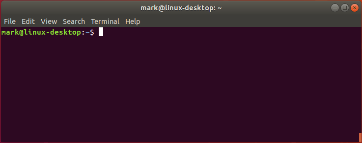

# Introduction to the command line

The primary way you interact with (almost) all Research Computing resources will be via the text-only command line which will look similar to:

The text `mark@linux-desktop:~$` is known as the command line prompt (or more simply the prompt) where you type your commands. 

This section will describe some helpful commands and useful tidbits regarding the Linux command line before getting into
more technical (but necessary) topics.

## Logging off (and how it impacts running programs)

The first command to know is `exit`.  This logs you off from the server.  Importantly, any programs you are running at the time, will also stop running with generally no way to restart from where it stopped.  This can be especially problematic if you are using programs that require a long time to complete their computations as you will not want to stay logged in over very long periods of time (many hours to days or more).

There are two exceptions or ways around this situation.  The first is to use Slurm to submit compute jobs [See submitting jobs](../slurm/01_sbatch.md).  In this case Slurm will keep the job running after you logoff the server.  However, not every Research Computing resource uses Slurm.  

That leads to the second exception, using tmux [See introduction to tmux]().

A second command to remember is `Ctrl+c`.  Every once in a while you may run a program and it may appear that nothing is happening other than the cursor is blinking but not at a prompt.  If this situation persists for a long time (several minutes or more) it may be that your program is stuck and not actually working.  If you press the `Ctrl+c` key combination it should stop your program, returning you to a prompt.  Sometimes you have to use this command two or three times in order to stop your program.

## Command history

Linux keeps a history of commands you use in a file.  This is history is extensive but may not be exahustive.  Usually only last 500 to 1000 
commands you have executed will be in history.

You can view your command history (it displays from oldest command to most recent command) using `history`.  If you have a large history many of the commands will scroll past you before you can see them.  A better choice then is to use `history | more`  This will cause the output to pause until you press space.  (See [Redirecting output]() for more detailed explanation of the use of `|`).  Each line output lists a number and the command.  The number may be useful if you wish to re-execute that command (see below).

### Less typing (sometimes)

The command line uses the history file in some useful ways that you should become familiar with as they can speedup your interaction (and save you some typing).

1. The up and down arrows will effectively scroll backward and forward in your history.  You will see the different commands show up at the prompt.
2. `!!` repeats the last typed command
3. `!*n*` where *n* is the number of the command output from `history`
3. `!` along with one or a few letters from the start of the command repeats commands other than the last one (i.e., most recent)

As an example, consider this snippet of history:

` 401 pwd
  402 ls
  403 python3 simulation.py config.txt
  404 cd ../data/output
  405 cat outfile.05292022.txt
`
1. Pressing up once will recall the last command `cat outfile.05292022.txt`.  Pressing up again will change the command to `cd ../data/output`
   This is very helpful especially when you need to edit a command before executing it
2. `!!` (and pressing `Enter`) will execute `cat outfile.05292022.txt`
3. `!403` (and pressing `Enter`) will execute `python3 simulation.py config.txt`
4. `!cd` (and pressing `Enter`) will execute `cd ../data/output`
    If you have not typed enough of the command to disambiguate among commands (e.g., `!c`) then the first command that matches will execute.  In this example that would be `cat outfile.05292022.txt`

Another useful tip not related to history, but one that saves some typing nonetheless, 
is the use of `tab` to help with command completion.  If you start to type a command (whether you've used it before or not) and press tab
(e.g., `his` then `tab`) the system will try to autocomplete the command, most likely with `history` in this case.  If there are multiple possible matches (e.g., `hi` might match `history` or `hipercdecode`) then nothing will display.  You must press `tab` a second time and it will list all matching commands.  With that information you can then type the rest of the command (or at least a few more letters to be more precise when using `tab` to autocomplete).

## htop