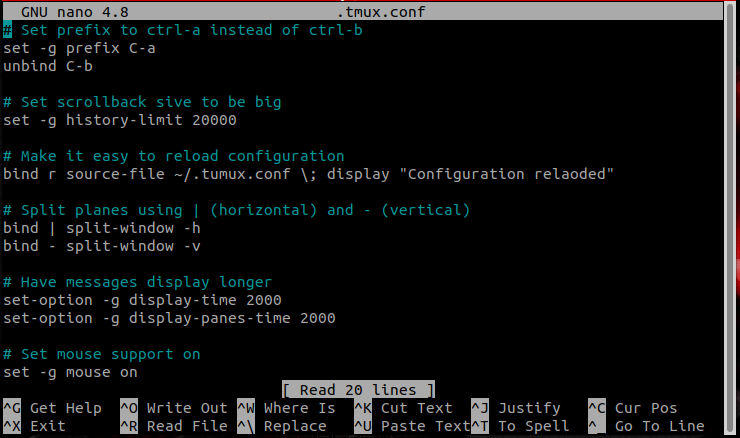

# Editing files on the command line

Linux comes with several different programs to edit files from the command line.  Here we will briefly present one of them, `nano`, 
which is on most Linux systems by default.  `nano` with no other arguments will open a blank file.  You can also open an existing file
or create a new file with a specific filename by providing the name of the file after `nano`.  For example, `nano myfile.txt`.  If
the file is in another directory (or you want it in another directory in the case of a new file) you can specify the file by its
path (e.g., `nano ~/proj1/dataset1.txt`) if you don't want to `cd` to that directory before editing.

One note about filenames.  `nano` and for that matter most Linux editors (e.g. emacs, vi, etc.) have no default extension (i.e. .txt).  You
must include that as part of the filename when you create/save the file.

The picture below shows the `nano` editor.  While editing files is pretty straightforward with nano, there are a few things we wish to
clarify.  First, common commands are given along the bottom of the screen and a more comprehensive list can be accessed via help.  However,
the keystrokes to use these commands is not what they seem to be.  The use of ^ translates to `Ctrl` so, `^X` translates to the combined
keystrokes of `Ctrl-X`.  The use of `M-` translates to `Alt` so `M-U` for undo is the combined keystrokes of `Alt-U`.  Finally, although 
the commands are shown with capital letters, you do not need to use a captial letter, so `Ctrl-x` will work just fine.

Second, a few of the commands are not the most clearly named.  Write Out `^O` saves the file.  If you exit and the file has been 
modified but not saved, `nano` will ask if you wish to save the file.  **Please get into the habit of saving often.**  Read File `^R`
opens a file.  For example, if you edit one file and then you want to edit another, you don't have to exit nano, you can use this command 
to open the other file.  Where Is `^W` searches the file for some text.  

Finally, at times it may be helpful to have line numbers displayed when editing a file.  This is accomplished with the combined keystroke
`Alt-Shift-3`  Typing it a second time will turn off line numbering.  Related if you wish to open a file to a specific line number
you can do `nano +# filename` replacing the `#` with the actual line number.  This can be useful when you need to edit a file 
because you have perhaps gotten an error that mentions a specific line in a file.

For a slightly more in-depth introduction to `nano`, you might look through [this tutorial](https://www.tecmint.com/learn-nano-text-editor-in-linux/), although
you should ignore the section describing how to install `nano`.