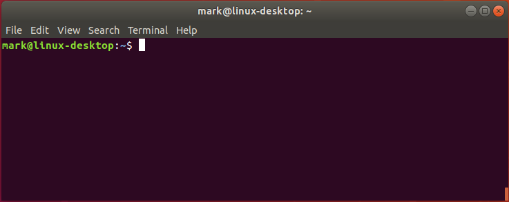
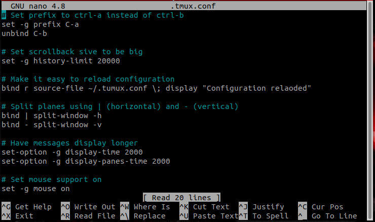
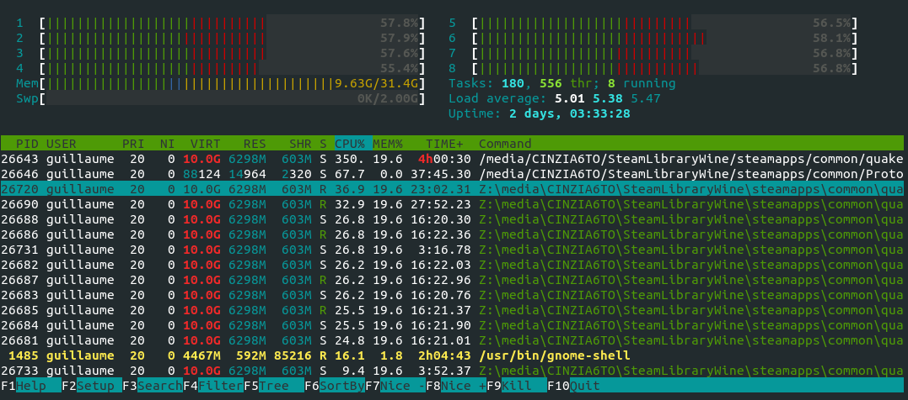
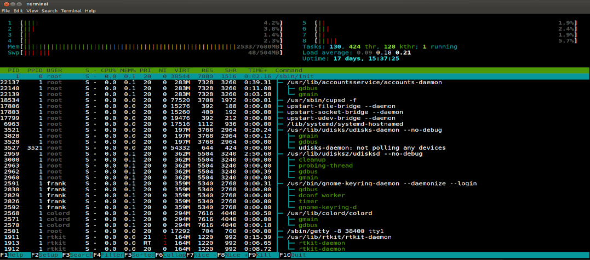

# Introduction: Linux command line

Most research computing resources use Linux as the operating system.  Although Linux does have a GUI similar to Windows and Mac OS X, more often 
than not you will be working at a command line interface which is text-based.  The tutorials provided here are meant to provide a very basic introduction 
to working with Linux via the command line.  More in-depth tutorials/explanations for topics and commands beyond those given here can be found on-line.

```note
You will may not be able to runn commands you might find beyond those given in the tutorials here because some of them require administrator privileges.
```

When you login into a server (likely using SSH) you will see something like the following:



The text `mark@linux-desktop:~$` is known as the command line prompt (or more simply the prompt) where you type your commands.  In the remainder of this section
of the tutorial we introduce some basic commands and tips.  In other sections of this multi-part tutorial we provide more details about working with files and directories 
which are critical to becoming comfortable working without a GUI.  The last  section on tmux...something about tmux

## Logging off

When you are done The first command to know is `exit`.  This logs you off (disconnects) from the server.  

```warning
Logging off also stops any software you might be running.  This will not be an issue on the cluster as long as you have submitted your software to run through Slurm (i.e., `sbatch`).  
On other resources,  we recommend using `tmux` [see introduction to tmux](tmux.md) if you need to log off a server but need to keep software running (e.g., because it take a long time to run).
```
## I ran a command and nothing seems to be happening

A second command to remember is `Ctrl+c`.  Every once in a while you may run a program and it may appear that nothing is happening other than the cursor is blinking but not at a prompt.  If this situation persists for a long time (several minutes or more) it may be that your program is stuck and not actually working.  If you press the `Ctrl+c` key combination it should stop your program, returning you to a prompt.  Sometimes you have to use this command two or three times in order to stop your program.

## Editing files

Linux comes with several different programs to edit files from the command line.  Here we will briefly present one of them, `nano`, 
which is on most Linux systems by default.  `nano` with no other arguments will open a blank file.  You can also open an existing file
or create a new file with a specific filename by providing the name of the file after `nano`.  For example, `nano myfile.txt`.  If
the file is in another directory (or you want it in another directory in the case of a new file) you can specify the file by its
path (e.g., `nano /home/auser/proj1/dataset1.txt`) if you don't want to `cd` to that directory before editing.

```note
`nano` and for that matter most Linux file editors have no default extension (i.e. .txt).  You
must include that as part of the filename when you create/save the file if you want a specific file extension
```

Below shows the `nano` editor.  While editing files is pretty straightforward with nano, there are a few things to 
clarify.  

1. Common commands are given along the bottom of the screen and a more comprehensive list can be accessed via help.
   - The use of `^` in the commands equates to the `Ctrl` key.  For example, `^X` would be the keystrokes `Ctrl+X`
   - The use of `M-` equates to the `Alt` key.  For example `M-U` to undo would be the keystrokes `Alt+U`
   - Even though the commands are presented using capital letters, you do not need to use a captial letter.
2. Some command names are unclear as to what they do.
  - Write Out `^O` saves the file.  If you exit and the file has been modified but not saved, `nano` will ask if you wish to save the file.  
  - Read File `^R`opens a file
  - Where Is `^W` searches the file for some text
3. Sometimes it may be helpful to show line numbers while editing a file.  This can be done using `Alt+Shift+3`.  If line numbers are displayed 
   and you wish to hide them, you would use the same keystroke combination.




For a slightly more in-depth introduction to `nano`, you might look through [this tutorial](https://www.tecmint.com/learn-nano-text-editor-in-linux/), although
you should ignore the section describing how to install `nano`.

## Monitoring CPU/Memory usage

The final command introduced in this section is `htop` This command produces a display similar to the one below and provides a lot of information about the processes running on the system.  You can 
close the `htop` display by pressing `q`.

Before explaining more about `htop` and it's usefulness, there is one caveat.  You can run `htop` on the cluster, however it will not be useful because it only provides information on `rcs-scsn.fandm.edu` 
which is the server you log into to submit your compute jobs.  The jobs themselves run on different servers so you won't be able to use `htop` to see what is going on with them.



While `htop` displays a lot of information about processes running on a computer system, there are two important things you should focus on

1. Information about CPUs (at the very top)
  - The number of CPUS (usually numbered 1 to *n*)
  - CPU usage
2. Information about memory (Just under the CPUs labelled Mem)
  - The amount of memory available on the system
  - The amount of memory being used

For example, in the `htop` output pictured above we can see

1. There are 8 CPUs
2. All CPUs are doing some sort of processing (indicated by the width of the green band) and
   each CPU has about 60% utilization
3. There is 32GB of memory on the system 
4. Currently about 9.5 GB of memory is being used

Or consider the `htop` display below:
1. Once again there are 8 CPUs
2. The CPUs are doing very little processing
3. There is 8GB of memory on the system
4. Currently about 2GB of memory is being used



You can use htop to your advantage in two key ways:

1. To see if your program requires a lot of CPU resources, memory resources, or both
  - Does the system you are trying to run on have those resources?
  - When running code on the cluster, the info from htop can help you make decisions regarding resources (e.g., CPUs) to request when submitting a job
2. If you want to run some code on a system but you see that system is already very busy with other programs, you can try a different system

## Taking advantage of command history

Linux keeps a history of commands you use in a file.  This is history is extensive but may not be exahustive in the sense that usually only the last 500 to 1000 
commands you have executed will be stored in history.

You can view your command history (it displays from oldest command to most recent command) using `history`.  If you have a large history, many of the commands 
will scroll past you before you can see them.  To prevent this you can  use `history | more`  which will cause the output to pause until you press space. 
Each line output lists a number and the command.  The number may be useful if you wish to re-execute that command (see below).

### Less typing (sometimes)

The command line uses the history file in some useful ways that you should become familiar with as they can speedup your interaction (and save you some typing).

1. The up and down arrows will effectively scroll backward and forward in your history.  You will see the different commands show up at the prompt.
2. `!!` repeats the last typed command
3. `!*n*` where *n* is the number of the command output from `history`
3. `!` along with one or a few letters from the start of the command repeats commands other than the last one (i.e., most recent)

As an example, consider this snippet of history:

```bash
401 pwd
402 ls
403 python3 simulation.py config.txt
404 cd ../data/output
405 cat outfile.05292022.txt
```

1. Pressing up once will recall the last command `cat outfile.05292022.txt`.  Pressing up again will change the command to `cd ../data/output`
   This is very helpful especially when you need to edit a command before executing it
2. `!!` (and pressing `Enter`) will execute `cat outfile.05292022.txt`
3. `!403` (and pressing `Enter`) will execute `python3 simulation.py config.txt`
4. `!cd` (and pressing `Enter`) will execute `cd ../data/output`
    If you have not typed enough of the command to disambiguate among commands (e.g., `!c`) then the first command that matches will execute.  In this example that would be `cat outfile.05292022.txt`

Another useful tip not related to history, but one that saves some typing nonetheless, 
is the use of `tab` to help with command completion.  If you start to type a command (whether you've used it before or not) and press tab
(e.g., `his` then `tab`) the system will try to autocomplete the command, most likely with `history` in this case.  If there are multiple possible matches (e.g., `hi` might match `history` or `hipercdecode`) then nothing will display.  You must press `tab` a second time and it will list all matching commands.  With that information you can then type the rest of the command (or at least a few more letters to be more precise when using `tab` to autocomplete).

