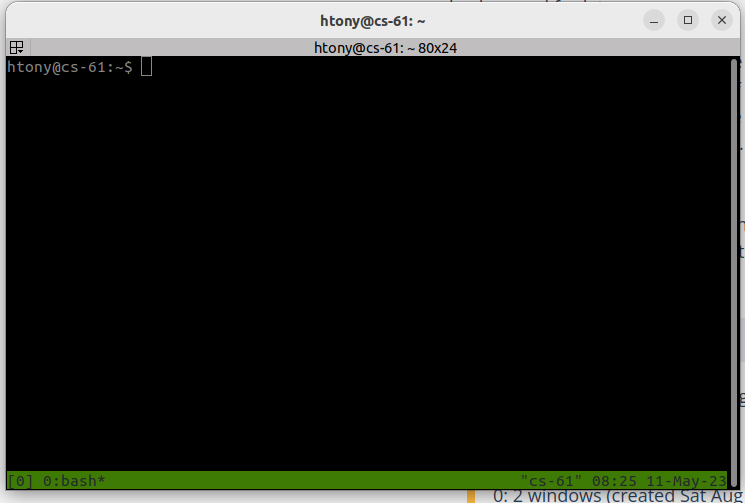

# Introduction to tmux

For programs that may run a long time (hours or more) that are not being run on the research cluster, we suggest using `tmux`.  Among 
the different things that it does, `tmux` easily allows you to keep programs running without the need to stay constantly connected to the 
compute resource.  Normally, when you exit/logoff from a Linux server, any programs you have running stop running.  Using `tmux` prevents this
from happening.  Here we will discuss the very basics of using `tmux` but there are additional more in depth tutorials which can be found 
on-line.

```tmux``` will start a new session which will look something like the following:



Once you have started a `tmux` session you can run commands as you normally would.  If the command you are running will take a long time to complete,
then once it is started you can type ```Ctrl-b d``` (Press ```control``` and ```b``` together, release, then press ```d```).  This detaches from
the tmux session returning you to a regular command-line.  Importantly this command keeps that session and anything running in that session running 
in the background.  Once you have detached from tmux, you can then logoff the server and your commands will continue to run.

You can access the session again using ```tmux attach```.  When you are done with your tmux session, you should ```exit``` when in the tmux session.